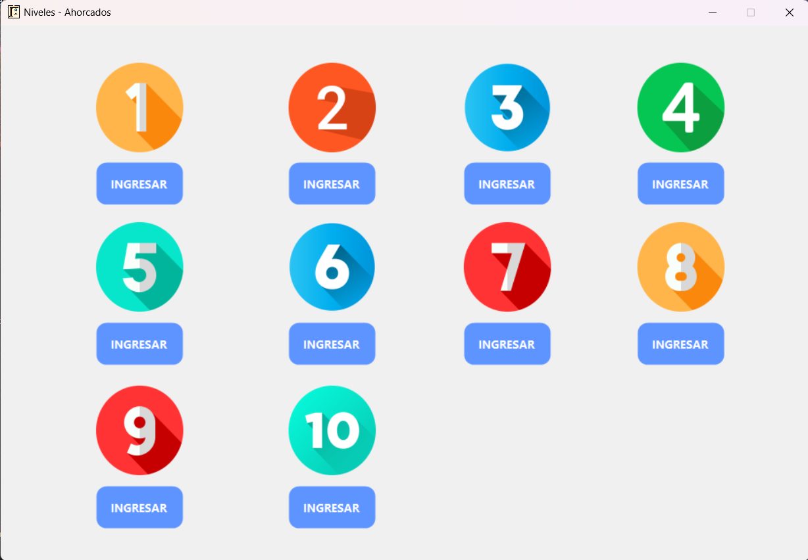
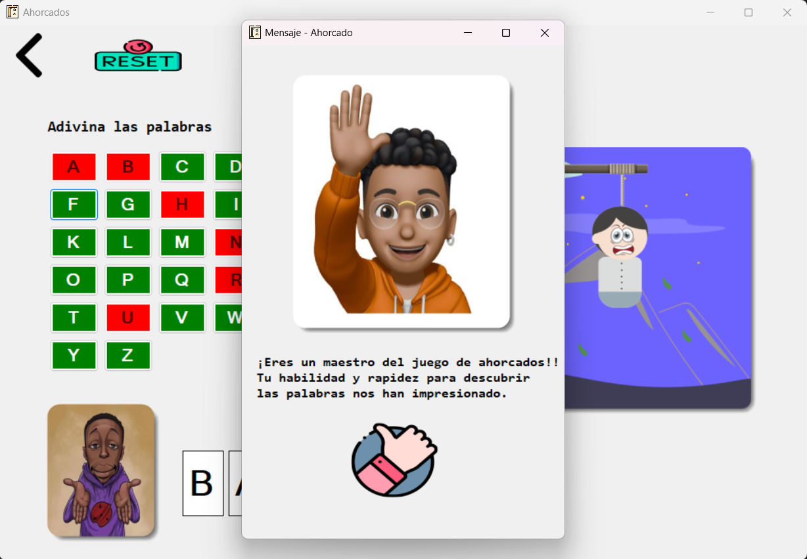
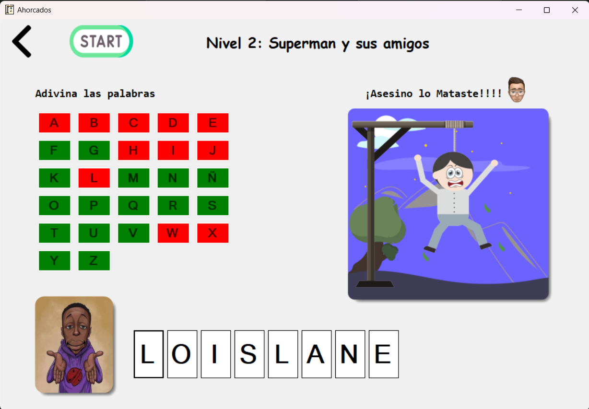

# Juego de Ahorcados

¡Bienvenido al juego de Ahorcados! Este proyecto es una implementación clásica del juego de palabras donde el jugador debe adivinar la palabra secreta letra por letra antes de que se complete el dibujo del ahorcado.

## Características

- **Juego clásico**: Adivina la palabra letra por letra.
- **Niveles**: Diferentes niveles con palabras de distintos temas.
- **Interfaz intuitiva**: Diseño amigable y fácil de usar.
- **Gráficos interactivos**: Visualiza tu progreso con un dibujo del ahorcado.
- **Multilenguaje**: Compatible con palabras en diferentes idiomas. (en prueba)

## Capturas de pantalla

### Pantalla de niveles

### Pantalla de victoria

### Pantalla de derrota

## Cómo jugar

1. Selecciona un nivel para comenzar el juego.
2. Haz clic en las letras del alfabeto para intentar adivinar la palabra secreta.
3. Si la letra es correcta, se revelará en la palabra. Si es incorrecta, se añadirá una parte al dibujo del ahorcado.
4. El juego termina cuando adivinas la palabra completa o se completa el dibujo del ahorcado.

## Instalación

1. Descarga el instalador: [Haz click para descargar Instalador](https://github.com/RFBS23/Ahorcados/releases/download/1.0.1/Ahorcados.-.FabriDev.msi)
2. Abre el instalador en tu entorno de desarrollo favorito.
3. Ejecuta el instalador y comienza a jugar.

## Licencia

Este proyecto está bajo la licencia MIT. Consulta el archivo [LICENSE](LICENSE.txt) para más detalles.

## Contacto

Si tienes alguna pregunta o sugerencia, no dudes en contactarme a través de [fabriziobarrios92@gmail.com](mailto:fabriziobarrios92@gmail.com).

## Desarrollador

<h3><b>Aplicacion Desarrollada por:</b> Fabrizio Barrios Saavedra (RFBS19 - FabriDev)</h3>
